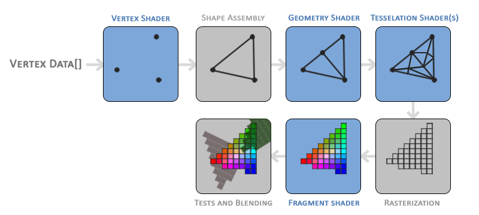

###渲染pipeline
pipeline我的理解是该翻译成“流水线”，而不是常见的”管线“。因为它的意思就是像流水线一样工作，是把输入的数据一步步变成屏幕上的像素的过程。而”管线“很容易联想到管道，就想偏了。”流水线“更让人注意到它本质是一个流程，是一个过程，而不是一个...管子？



* 对于任何一个模型，不管3D、2D,最初都是点的数据。比如一个正方形，就是4个角的坐标，立方体，就是8个点的坐标，一个游戏里的复杂人物，实际是许多的点拼接起来的，搜一下”三维模型“图片就有直观感受。所以整个流程输入的是顶点的数据，即Vertex Data.
* 而最终呈现给用户的是显示屏上的图像，而图像是一个个像素构成，所以输出的是每一个像素的颜色。整个流程要做的就是：怎么把一个个坐标数据变成屏幕上正确的像素颜色呢？
* 这张图片还是很直观的。而蓝色部分就是现代OpenGL可以让我们编写参与的部分。shader译作”着色器“，它是流程中的一段子程序，负责处理某一个阶段的任务，就像流水线上有很多不同的机器和人，它们负责一部分工作。
 * Vertex shader是第一个shader,它负责处理输入的顶点数据，比如坐标变换
 * Geometry shader和Tesselation shader,不是必须的。
 * Fragment shader这时接受的已经不是顶点，而是fragment,有碎片的意思，它就对应着一个像素单位。这一阶段主要就是要计算颜色，比如光照计算：在有N个光源的时候，这个fragment的颜色是什么，光的颜色、物体本身的颜色、这个fragment朝向等都要考虑。

所以要绘制一个三角形，需要提供3个点的数据以及编写vertex shader和fragment shader.

###加载shader

shader是一个子程序，它有自己的语言glsl,也需要编译才能使用。glsl和c类似，如绘制三角形需要的vertex shader：

```
const GLchar *vertexShaderSource =
"#version 330 core                          \n\
layout (location = 0) in vec3 position;     \n\
void main(){                                \n\
    gl_Position = vec4(position, 1.0f);     \n\
}                                           \n\
";
```
先忽略掉”\n\“，这只是为了多行输入字符串，shader的内容从`#version`开始。

有了shader的代码，下一步就是把shader代价加载到它的编译器里：

```
GLuint vertexShader = glCreateShader(GL_VERTEX_SHADER);
glShaderSource(vertexShader, 1, &vertexShaderSource, 0);
glCompileShader(vertexShader);
```
先用glCreateShader生成一个shader对象，然后通过glShaderSource把shader代码提供给这个shader，最后编译这个shader: glCompileShader。

如果shader代码写错了，编译之后就会报错，所以这时需要检查下shader的编译情况：

```
GLint succeed;
GLchar infoLog[256];
glGetShaderiv(vertexShader, GL_COMPILE_STATUS, &succeed);
if (!succeed) {
    glGetShaderInfoLog(vertexShader, sizeof(infoLog),NULL, infoLog);
    std::cout<< "compile vertex shader error: "<< infoLog << std::endl;
    return -1;
}
```
先使用glGetShaderiv获取shader的编译状态，这种函数方式也是常见的：

 * iv表示int value, 带这种后缀的用来区分返回值或传入值的类型
 * 然后有一个参数用来表示获取什么值，这里是GL_COMPILE_STATUS，表示获取shader的编译状态。

如果编译状态为失败，就获取log信息，查看哪里出错：glGetShaderInfoLog。

fragment shader使用同样的方式加载进来：

```
const GLchar *fragmentShaderSource =
"#version 330 core                          \n\
out vec4 color;                             \n\
void main(){                                \n\
    color = vec4(1.0f, 0.0f, 0.0f, 1.0f);   \n\
}                                           \n\
";
```

```
GLuint fragmentShader = glCreateShader(GL_FRAGMENT_SHADER);
glShaderSource(fragmentShader, 1, &fragmentShaderSource, 0);
glCompileShader(fragmentShader);
    
glGetShaderiv(fragmentShader, GL_COMPILE_STATUS, &succeed);
if (!succeed) {
    glGetShaderInfoLog(fragmentShader, sizeof(infoLog),NULL, infoLog);
    std::cout<< "compile fragment shader error: "<< infoLog << std::endl;
    return -1;
}
```

###program

shader加载完后，不同的shader需要连接到一起，测试是否可以一起使用；还需要由这些shder生成可执行文件(executable)给渲染流程。

所以这时需要一个shader容器，或说管理者，即program。

```
program = glCreateProgram();
glAttachShader(program, vertexShader);
glAttachShader(program, fragmentShader);
glLinkProgram(program);
```

先生成一个program,然后使用`glAttachShader`把一起使用的所有shader都绑定到这个program上；最后使用`glLinkProgram`把链接program。

最后在渲染时，使用`glUseProgram(program);`指定使用的program。

###准备数据：VBO和VAO
准备好shader后，处理流程的逻辑已经准备好，缺的就是数据了。
 
 VBO是vertex buffer object,是用来存储顶点数据的缓冲区对象. Buffer Object具体是什么？
 
 >Buffer Objects are OpenGL Objects that store an array of unformatted memory allocated by the OpenGL context (aka: the GPU).
 
 就是在GPU中申请的一块内存，用于存放数据。之前有直接模式：每次绘制都要把数据提交过去。后来发展成为”顶点数组“，数据存放在电脑内存中，绘制的时候提供位置索引。再到现在的buffer object，数据存放在GPU端，这样进一步加快了数据传递。
 
  1. 先生成一个buffer object
  
     ```
  GLuint VBO;
  glGenBuffers(1, &VBO);
  ```
  2. 然后绑定:
   
   	  ```
   glBindBuffer(GL_ARRAY_BUFFER, VBO);
   ```
   在生成VBO后，其实它和任何其他的Buffer object没有任何的区别，所以还需要做的就是:谁来使用这个数据，以及怎么使用。glBindBuffer就是指定谁来使用的问题.使用`GL_ARRAY_BUFFER `表示这个buffer用来存储顶点属性数据。
   顶点属性是什么？
   在返回vertex shader的代码：
  `layout (location = 0) in vec3 position;`
   顶点的坐标position就是属性之一，这个shader配合VBO，那么position的数据就从这个buffer object读取。
   
   3. 输入数据

  	  ```
  GLfloat vertices[] = {
        -0.5f, -0.3f, 0.0f,
        0.5f, -0.3f, 0.0f,
        0.0f, 0.8f, 0.0f
    };
    glBufferData(GL_ARRAY_BUFFER, sizeof(vertices), 	vertices, GL_STATIC_DRAW);
  ```
  先把数据输入，glBufferData会给第一个参数对应的buffer object那里创建并初始化数据，因为之前绑定GL_ARRAY_BUFFER到VBO，所以VBO输入了vertices的数据。
  
  4. 读取数据的方式
  
     ```
     glVertexAttribPointer(0, 3, GL_FLOAT, GL_FALSE, 3*sizeof(GL_FLOAT), vertices);
    glEnableVertexAttribArray(0);
     ```
     默认数据对顶点属性是不可访问的，使用`glEnableVertexAttribArray `开启，参数就是shader代码里属性的位置，因为`layout (location = 0) in vec3 position;`,position这个属性的location设为了0，所以这里就是开启position的读取能力。
     
      `glVertexAttribPointer`比较关键的函数，决定了怎么读取数据，这个函数原型是：
      
     ```
     void glVertexAttribPointer(	GLuint index,
 	GLint size,
 	GLenum type,
 	GLboolean normalized,
 	GLsizei stride,
 	const GLvoid * pointer);

     ```
   * index指定这是描述哪个属性的，传入0，表示描述的是position这个属性读取数据的方式。
   * size是每次读取的数据大小
   * type是数据类型，这个配合size一起决定每次读取多大的内存。这里传入3和GL_FLOAT,也就是每个顶点的position读取3个浮点数。
   * normalized 是指数据是否需要被归一化，所谓”normalize“，就是把数值映射到[-1,1](有符号数)或[0,1],有符号数。这里不需要，传入GL_FALSE.
   * stride 有很多的顶点都从这里读取数据，读完一个后，下一个从哪里开始读取，stride就是跳过的距离.比如：12 34 56 78,读完3位置的内存后，如果stride设为4，那么就跳到7开始读取下一个数据。因为一个顶点3个浮点数，而且紧贴着就是下一个，所以传入3*sizeof(GL_FLOAT)。如果传入0，也是可以的，因为传入0时，就是读取完上一个，从结尾的位置开始读下一个。
   * pointer 这个用来指定读取开始位置的偏移。比如：12 34 56 78，12和56存的是属性1的数据，34和78存储的是属性2的数据，那么属性2读取的开始位置就不是buffer object的开头，有一段偏移。

 经过上面的一系列操作，顶点属性知道了在哪里读取数据（VBO）,也知道了如何读取数据，并且数据也输入到了VBO里。
 
 5. 最后还有VAO,即Vertex Array Object。每绘制一个物体，上面的步骤就要走一遍,除了顶点数据，可能还有索引数据。而VAO就是把这些状态（哪些属性可以读取数据，这些属性怎么读取，索引数据是哪些等）打包一起。绘制的时候调用一句`glBindVertexArray(VAO1);`那么和VAO1关联的所有状态都会启用，如果接着调用`glBindVertexArray(VAO2);`就可以又马上切换到VAO2的所有数据。应该是为了方便编码而设计的。

  因为有了VAO，可以把上面的数据处理都放到准备阶段，即渲染循环之前，而不是每次循环都去处理。渲染循环里只需要`glBindVertexArray`切换需要的VAO就可以。在准备阶段，哪些状态会被VAO绑定？
  
  ```
  glBindVertexArray(VAO1);
  //数据处理1
  glBindVertexArray(VAO2);
  //数据处理2
  glBindVertexArray(0);
  ```
  数据处理1位置做的所有操作的都会绑定到VAO1上，而数据处理2做的处理都会到VAO2上，也就是现在哪个VAO被绑定，就是作用在谁上。
  
###渲染循环

 ```
 glUseProgram(program);
 glBindVertexArray(VAO);
 glDrawArrays(GL_TRIANGLES, 0, 3);
 ```
 glUseProgram使用program，启用program关联的所有shader. glBindVertexArray启用VAO关联的所有数据和读取方式。数据和逻辑都有了，glDrawArrays绘制。
 
 * GL_TRIANGLES 表示绘制三角形，这里用来指定绘制的图元类型，所有复杂物体都是基本图形构成的，还有点（GL_POINTS）、线（GL_LINES）等.
 * 0和3指定绘制时使用的点的数据范围，从第0个开始，总共3个。因为只绘制一个三角形，所以使用3个点就可以了。

###回到shader

vertex shader

```
#version 330 core                          
layout (location = 0) in vec3 position;     
void main(){                                
    gl_Position = vec4(position, 1.0f);     
}                                          
```

* `#version 330 core `声明版本，这里是3.3，core表示使用core profile.另一种是：compatibility。compatibility是兼容模式，会保留之前的函数，而core会抛弃那些已经禁用的函数。学习就直接从core profile开启吧。
* `layout (location = 0) in vec3 position;`声明一个vec3类型的变量，vec是vector的缩写，即向量。vec3是3元向量，比如rgb、xyz坐标都是。layout和location用来指定这个属性的位置，配合VBO数据读取。
* main函数是主函数，在这里做顶点的处理。gl_Position是默认变量，是用来输出顶点数据给下一个阶段的。这里main函数里，只是把vec3变成vec4.

fragment shader

```
#version 400 core                          
out vec4 color;                             
void main(){                                
    color = vec4(1.0f, 0.0f, 0.0f, 1.0f);   
}
```

